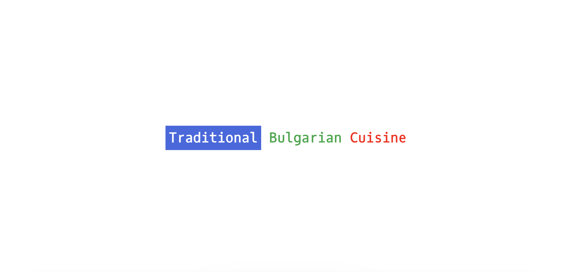

# Bulgarian Cuisine App
## Tools and technologies used: Visual Studio Code | MongoDB | Express | React | Node

# Bulgarian Cuisine App
> Live demo [_here_](https://www.example.com). <!-- If you have the project hosted somewhere, include the link here. -->

## Table of Contents
* [General Info](#general-information)
* [Technologies Used](#technologies-used)
* [Features](#features)
* [Screenshots](#screenshots)
* [Setup](#setup)
* [Usage](#usage)
* [Project Status](#project-status)
* [Contact](#contact)
<!-- * [License](#license) -->

## General Information
- Bulgarian Cuisine App is an online provider of information about traditional Bulgarian cuisine, food, recipes, restaurants.

## Technologies Used
- MongoDB -  v6.0.1
- Express.js - v4.18.2
- React - v18.2.0
- Node.js - v19.8.1
- Visual Studio Code - v1.71.2
- macOS - v12.6

## Features
List the ready features here:
- Register/Login
- Save Recipe

## Screenshots

<!-- If you have screenshots you'd like to share, include them here. -->

## Setup

<!-- Proceed to describe how to install / get started with the project. -->

## Usage
<!-- How does one go about using it? -->

## Project Status
Project is: _in progress_ 

## Contact
Created by [@GGG](http://3gbg.s3-website.eu-west-2.amazonaws.com/#intro) - feel free to contact me!